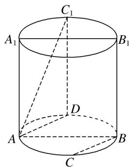

> [!faq]- 《专题07 立体几何中空间角的计算-立体几何（文理通用）》例题解析
>
> > [!success]- **【答案】** 详见解析
>
> > [!note]- **【解析】**
> > 答案 $\sqrt{2}$ 解析 取圆柱下底面弧 $AB$ 的另一中点 $D$ , 连接 $C_{1}D$ , $AD$ , 因为 $C$ 是圆柱下底面弧 $AB$ 的中点,
> >
> > 
> >
> > 所以 $AD \parallel BC$ ，所以直线 $AC_{1}$ 与 $AD$ 所成的角即为异面直线 $AC_{1}$ 与 $BC$ 所成的角，因为 $C_{1}$ 是圆柱上底面弧 $A_{1}B_{1}$ 的中点，所以 $C_{1}D \perp$ 圆柱下底面，所以 $C_{1}D \perp AD$ 。因为圆柱的轴截面 $ABB_{1}A_{1}$ 是正方形，所以 $C_{1}D = \sqrt{2} AD$ ，所以直线 $AC_{1}$ 与 $AD$ 所成角的正切值为 $\sqrt{2}$ ，所以异面直线 $AC_{1}$ 与 $BC$ 所成角的正切值为 $\sqrt{2}$ 。
