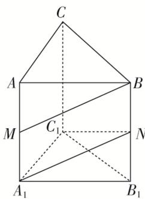

> [!faq]- 《专题07 立体几何中空间角的计算-立体几何（文理通用）》例题解析
>
> > [!success]- **【答案】** 详见解析
>
> > [!note]- **【分析】**
> > 本题未单列分析。
>
> > [!note]- **【解析】**
> > 答案 $\frac{3}{5}$ 解析 如图，连接 $A_{1}N$ ，则 $A_{1}N // BM$ ，所以异面直线 $BM$ 与 $C_{1}N$ 所成的角就是直线 $A_{1}N$ 和 $C_{1}N$ 所成的角．由题意，得 $A_{1}N = C_{1}N = \sqrt{2^{2} + 1^{2}} = \sqrt{5}$ ，在 $\triangle A_{1}C_{1}N$ 中，由余弦定理得 $\cos \angle A_{1}NC_{1} = \frac{5 + 5 - 4}{2\times\sqrt{5}\times\sqrt{5}} = \frac{3}{5}$ 所以异面直线 $BM$ 与 $C_{1}N$ 所成角的余弦值为 $\frac{3}{5}$ .
> > 
