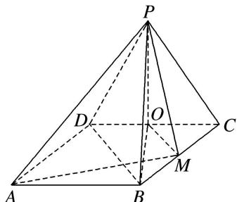

> [!faq]- 《专题07 立体几何中空间角的计算-立体几何（文理通用）》例题解析
>
> > [!success]- **【答案】** A
>
> > [!note]- **【分析】**
> > 本题未单列分析。
>
> > [!note]- **【解析】**
> > 答案 C 解析 连接 $BD, OB$ , 则 $OM \parallel DB$ , $\therefore \angle PDB$ 或其补角为异面直线 $OM$ 与 $PD$ 所成的角.
> >
> > 
> >
> > 由已知条件可知 $PO \perp$ 平面 $ABCD, OB = 3, PO = \sqrt{3}, BD = 2\sqrt{3}, PB = 2\sqrt{3}$ ，在 $\triangle PBD$ 中，由余弦定理可得 $\cos \angle PDB = \frac{PD^2 + BD^2 - PB^2}{2PD \cdot BD} = \frac{4 + 12 - 12}{2 \cdot 2 \cdot 2\sqrt{3}} = \frac{\sqrt{3}}{6}$ .
