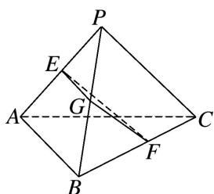

> [!faq]- 《专题07 立体几何中空间角的计算-立体几何（文理通用）》例题解析
>
> > [!success]- **【答案】** A
>
> > [!note]- **【分析】**
> > 本题未单列分析。
>
> > [!note]- **【解析】**
> > 答案 A 解析 如图，取 $PB$ 的中点 $G$ ，连接 $EG, FG$ ，则 $EG = \frac{1}{2} AB, GF = \frac{1}{2} PC, EG // AB, GF // PC$ ，则 $\angle EGF$ （或其补角）即为 $AB$ 与 $PC$ 所成的角，在 $\triangle EFG$ 中， $EG = \frac{1}{2} AB = 3, FG = \frac{1}{2} PC = 4, EF = 5, EG^2 + FG^2 = EF^2$ ，所以 $\angle EGF = 90^\circ$ .
> > 
