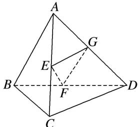

> [!faq]- 《专题07 立体几何中空间角的计算-立体几何（文理通用）》例题解析
>
> > [!success]- **【答案】** D
>
> > [!note]- **【分析】**
> > 本题未单列分析。
>
> > [!note]- **【解析】**
> > 答案 D 解析 设 G 为 AD 的中点，连接 GF, GE,
> > 
> > 则 $GF, GE$ 分别为 $\triangle ABD, \triangle ACD$ 的中位线．由此可得 $GF \parallel AB$ ，且 $GF = \frac{1}{2} AB = 1, GE \parallel CD$ ，且 $GE = \frac{1}{2} CD = 2, \therefore \angle FEG$ 或其补角即为 $EF$ 与 $CD$ 所成的角．又 $EF \perp AB, GF \parallel AB, \therefore EF \perp GF$ ．因此，在 Rt $\triangle EFG$ 中， $GF = 1, GE = 2, \therefore \sin \angle GEF = \frac{GF}{GE} = \frac{1}{2}$ ，又 $\angle GEF$ 为锐角， $\therefore \angle GEF = 30^\circ$ ． $\therefore EF$ 与 $CD$ 所成的角的大小为 $30^\circ$ ．在正三棱柱 $ABC - A_1B_1C_1$ 中， $AB = \sqrt{2} BB_1$ ，则 $AB_1$ 与 $BC_1$ 所成角的大小为（）A. $30^\circ$ B. $60^\circ$ C. $75^\circ$ D. $90^\circ$
> > 9. 答案 D 解析 将正三棱柱 $ABC - A_{1}B_{1}C_{1}$ 补为四棱柱 $ABCD - A_{1}B_{1}C_{1}D_{1}$ ，连接 $C_{1}D$ ， $BD$ ，则 $C_{1}D \parallel B_{1}A$ ， $\angle BC_{1}D$ 为所求角或其补角。设 $BB_{1} = \sqrt{2}$ ，则 $BC = CD = 2$ ， $\angle BCD = 120^{\circ}$ ， $BD = 2\sqrt{3}$ ，又因为 $BC_{1} = C_{1}D = \sqrt{6}$ ，所以 $\angle BC_{1}D = 90^{\circ}$ 。
