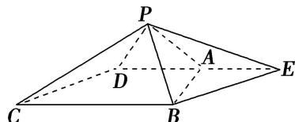

> [!faq]- 《专题07 立体几何中空间角的计算-立体几何（文理通用）》例题解析
>
> > [!success]- **【答案】** 详见解析
>
> > [!note]- **【分析】**
> > 本题未单列分析。
>
> > [!note]- **【解析】**
> > 答案 $90^{\circ}$ 解析 如图所示，延长 DA 至 E，使 AE=DA，连接 PE，BE.
> >
> > 
> >
> > $\because \angle ABC = \angle BAD = 90^{\circ}, BC = 2AD, \therefore DE = BC, DE // BC.$ 四边形 $CBED$ 为平行四边形， $\therefore CD // BE.$ $\therefore \angle PBE$ 就是异面直线 $CD$ 与 $PB$ 所成的角．在 $\triangle PAE$ 中， $AE = PA, \angle PAE = 120^{\circ}$ ，由余弦定理，得 $PE = \sqrt{PA^{2} + AE^{2} - 2PA \cdot AE \cos \angle PAE} = \sqrt{AE^{2} + AE^{2} - 2AE \cdot AE \cdot \left(-\frac{1}{2}\right)} = \sqrt{3}AE.$ 在 $\triangle ABE$ 中， $AE = AB, \angle BAE = 90^{\circ}, \therefore BE = \sqrt{2}AE.$ $\because \triangle PAB$ 是等边三角形， $\therefore PB = AB = AE, \therefore PB^{2} + BE^{2} = AE^{2} + 2AE^{2} = 3AE^{2} = PE^{2}, \therefore \angle PBE = 90^{\circ}.$
