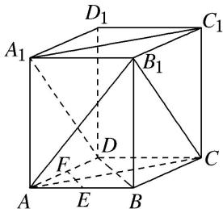

> [!faq]- 《专题07 立体几何中空间角的计算-立体几何（文理通用）》例题解析
>
> > [!success]- **【答案】** 详见解析
>
> > [!note]- **【分析】**
> > 本题未单列分析。
>
> > [!note]- **【解析】**
> > 答案 $60^{\circ} 90^{\circ}$ 解析
> > (1)如图所示, 连接 $B_{1}C$ , $AB_{1}$ , 由 $ABCD - A_{1}B_{1}C_{1}D_{1}$ 是正方体, 易知 $A_{1}D // B_{1}C$ , 从而 $B_{1}C$ 与 $AC$ 所成的角就是 $AC$ 与 $A_{1}D$ 所成的角. $\because AB_{1} = AC = B_{1}C$ , $\therefore \angle B_{1}CA = 60^{\circ}$ . 即 $A_{1}D$ 与 $AC$ 所成的角为 $60^{\circ}$ .
> >
> > 
> >
> > 连接 BD，在正方体 $ABCD-A_{1}B_{1}C_{1}D_{1}$ 中， $AC \perp BD$ ， $AC \parallel A_{1}C_{1}$ ，∵E，F 分别为 AB，AD 的中点，∴ $EF \parallel BD$ ，∴ $EF \perp AC$ ．∴ $EF \perp A_{1}C_{1}$ ．即 $A_{1}C_{1}$ 与 EF 所成的角为 $90^{\circ}$ ．
> >
> > 3. 如图所示, 等腰直角三角形 $ABC$ 中, $\angle A = 90^{\circ}$ , $BC = \sqrt{2}$ , $DA \perp AC$ , $DA \perp AB$ , 若 $DA = 1$ , 且 $E$ 为 $DA$ 的中点, 则异面直线 $BE$ 与 $CD$ 所成角的余弦值为 \_\_\_\_.
> >
> > 
