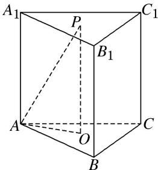

> [!faq]- 《专题07 立体几何中空间角的计算-立体几何（文理通用）》例题解析
>
> > [!success]- **【答案】** C
>
> > [!note]- **【分析】**
> > 本题未单列分析。
>
> > [!note]- **【解析】**
> > 答案 $60^{\circ}$ 解析 如图所示，设 $O$ 为 $\triangle ABC$ 的中心，连接 $PO, AO$ ，易知 $PO \perp$ 平面 $ABC$ ，则 $\angle PAO$ 为 $PA$ 与平面 $ABC$ 所成的角。 $S_{\triangle ABC} = \frac{1}{2} \times \sqrt{3} \times \sqrt{3} \times \sin 60^{\circ} = \frac{3\sqrt{3}}{4}, \therefore V_{ABCA_1B_1C_1} = S_{\triangle ABC} \cdot OP = \frac{3\sqrt{3}}{4} \times OP = \frac{9}{4}, \therefore OP = \sqrt{3}$ 。又 $OA = \sqrt{3} \times \frac{\sqrt{3}}{2} \times \frac{2}{3} = 1, \therefore \tan \angle OAP = \frac{OP}{OA} = \sqrt{3}, \therefore \angle OAP = 60^{\circ}$ 。故 $PA$ 与平面 $ABC$ 所成角为 $60^{\circ}$ 。
> > 
> > (2)(2018·全国Ⅰ)在长方体 $ABCD-A_{1}B_{1}C_{1}D_{1}$ 中， $AB=BC=2$ ， $AC_{1}$ 与平面 $BB_{1}C_{1}C$ 所成的角为 $30^{\circ}$ ，则该长方体的体积为( )
> > A. 8
> > B. $6\sqrt{2}$ C. $8\sqrt{2}$ D. $8\sqrt{3}$
> > 答案 C 解析 如图, 连接 $AC_{1}, BC_{1}, AC$ . ∵ $AB \perp$ 平面 $BB_{1}C_{1}C$ , ∴ $\angle AC_{1}B$ 为直线 $AC_{1}$ 与平面 $BB_{1}C_{1}C$ 所成的角, ∴ $\angle AC_{1}B = 30^{\circ}$ . 又 AB = BC = 2, 在 Rt△ABC₁ 中, $AC_{1} = \frac{2}{\sin 30^{\circ}} = 4$ . 在 Rt△ACC₁ 中, $CC_{1} = \sqrt{AC_{1}^{2} - AC^{2}} = \sqrt{4^{2} - (2^{2} + 2^{2})} = 2\sqrt{2}$ , ∴ $V_{长方体} = AB \times BC \times CC_{1} = 2 \times 2 \times 2\sqrt{2} = 8\sqrt{2}$ .
> > 
> > ## 【对点训练】
