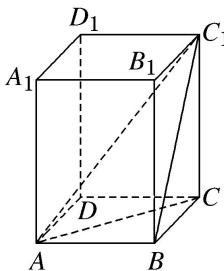

> [!faq]- 《专题07 立体几何中空间角的计算-立体几何（文理通用）》例题解析
>
> > [!success]- **【答案】** C
>
> > [!note]- **【分析】**
> > 本题未单列分析。
>
> > [!note]- **【解析】**
> > 答案 C 解析 如图, 连接 $AC_{1}, BC_{1}, AC$ . ∵ $AB \perp$ 平面 $BB_{1}C_{1}C$ , ∴ $\angle AC_{1}B$ 为直线 $AC_{1}$ 与平面 $BB_{1}C_{1}C$ 所成的角, ∴ $\angle AC_{1}B = 30^{\circ}$ . 又 AB = BC = 2, 在 Rt△ABC₁ 中, $AC_{1} = \frac{2}{\sin 30^{\circ}} = 4$ . 在 Rt△ACC₁ 中, $CC_{1} = \sqrt{AC_{1}^{2} - AC^{2}} = \sqrt{4^{2} - (2^{2} + 2^{2})} = 2\sqrt{2}$ , ∴ $V_{长方体} = AB \times BC \times CC_{1} = 2 \times 2 \times 2\sqrt{2} = 8\sqrt{2}$ .
> >
> > 
> >
> > ## 【对点训练】
