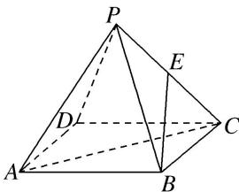

<!-- question-source:start -->
2. 如图, 正四棱锥 $P - ABCD$ 的体积为 2 , 底面积为 6 , $E$ 为侧棱 $PC$ 的中点, 则直线 $BE$ 与平面 $PAC$ 所成的角为 ( )

A. $60^{\circ}$ B. $30^{\circ}$ C. $45^{\circ}$ D. $90^{\circ}$
<!-- question-source:end -->

![[高中/总复习/专题/立体几何/专题07 立体几何中空间角的计算-立体几何（文理通用）/考点02_直线与平面所成的角/对点训练/answers/Q00039620A1.md]]
