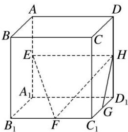

<!-- question-source:start -->
5. 如图, 在正方体 $ABCD—A_{1}B_{1}C_{1}D_{1}$ 中, $E$ , $F$ , $G$ , $H$ 分别为棱 $AA_{1}$ , $B_{1}C_{1}$ , $C_{1}D_{1}$ , $DD_{1}$ 的中点, 则 $GH$ 与平面 $EFH$ 所成的角的余弦值为 \_\_\_\_.

<!-- question-source:end -->

![[高中/总复习/专题/立体几何/专题07 立体几何中空间角的计算-立体几何（文理通用）/考点02_直线与平面所成的角/对点训练/answers/Q00039623A1.md]]
