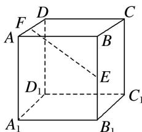

<!-- question-source:start -->
7. 已知 $E$ ， $F$ 分别是正方体 $ABCD - A_{1}B_{1}C_{1}D_{1}$ 的棱 $BB_{1}$ ， $AD$ 的中点，则直线 $EF$ 和平面 $BDD_{1}B_{1}$ 所成的角的正弦值是（）

A. $\frac{\sqrt{2}}{6}$ B. $\frac{\sqrt{3}}{6}$ C. $\frac{1}{3}$ D. $\frac{\sqrt{6}}{6}$
<!-- question-source:end -->

![[高中/总复习/专题/立体几何/专题07 立体几何中空间角的计算-立体几何（文理通用）/考点02_直线与平面所成的角/对点训练/answers/Q00039625A1.md]]
