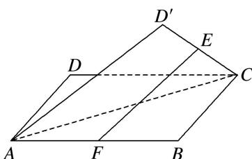

<!-- question-source:start -->
10. 如图, 设 $E$ , $F$ 分别是正方形 $ABCD$ 中 $CD$ , $AB$ 边的中点, 将 $\triangle ADC$ 沿对角线 $AC$ 对折, 使得直线 $EF$ 与 $AC$ 异面, 记直线 $EF$ 与平面 $ABC$ 所成的角为 $\alpha$ , 与异面直线 $AC$ 所成的角为 $\beta$ , 则当 $\tan \beta = \frac{1}{2}$ 时, $\tan \alpha$ 等于( )

A. $\frac{3\sqrt{5}}{16}$ B. $\frac{\sqrt{5}}{5}$ C. $\frac{\sqrt{51}}{17}$ D. $\frac{\sqrt{57}}{19}$
<!-- question-source:end -->

![[高中/总复习/专题/立体几何/专题07 立体几何中空间角的计算-立体几何（文理通用）/考点02_直线与平面所成的角/对点训练/answers/Q00039628A1.md]]
