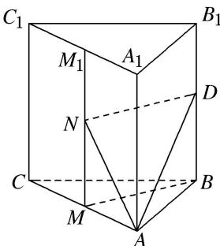

> [!faq]- 《专题07 立体几何中空间角的计算-立体几何（文理通用）》例题解析
>
> > [!success]- **【答案】** B
>
> > [!note]- **【分析】**
> > 本题未单列分析。
>
> > [!note]- **【解析】**
> > 答案 B 解析 如图，取 $AC, A_{1}C_{1}$ 的中点分别为 $M, M_{1}$ ，连接 $MM_{1}, BM$ ，过点 $D$ 作 $DN \parallel BM$ 交 $MM_{1}$ 于点 $N$ ，则易证 $DN \perp$ 平面 $AA_{1}C_{1}C$ ，连接 $AN$ ，则 $\angle DAN$ 为 $AD$ 与平面 $AA_{1}C_{1}C$ 所成的角。在 Rt $\triangle DNA$ 中， $\sin \angle DAN = \frac{DN}{AD} = \frac{\sqrt{3}}{\sqrt{2}} = \frac{\sqrt{6}}{4}$ 。
> > 
