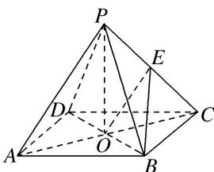

> [!faq]- 《专题07 立体几何中空间角的计算-立体几何（文理通用）》例题解析
>
> > [!success]- **【答案】** A
>
> > [!note]- **【分析】**
> > 本题未单列分析。
>
> > [!note]- **【解析】**
> > 答案 A 解析 如图，在正四棱锥 P-ABCD 中，根据底面积为 6 可得， $BC=\sqrt{6}$ 。连接 BD 交 AC 于点 O，连接 PO，则 PO 为正四棱锥 P-ABCD 的高，根据体积公式可得，PO=1。因为 $PO \perp$ 底面 ABCD，所以 $PO \perp BD$ ，又 $BD \perp AC$ ， $PO \cap AC = O$ ，所以 $BD \perp$ 平面 PAC，连接 EO，则 $\angle BEO$ 为直线 BE 与平面 PAC 所成的角。在 Rt△POA 中，因为 PO=1， $OA=\sqrt{3}$ ，所以 PA=2， $OE=\frac{1}{2}PA=1$ ，在 Rt△BOE 中，因为 $BO=\sqrt{3}$ ，所以 $\tan\angle BEO=\frac{BO}{OE}=\sqrt{3}$ ，即 $\angle BEO=60^{\circ}$ 。故直线 BE 与平面 PAC 所成角为 $60^{\circ}$ 。
> >
> > 
