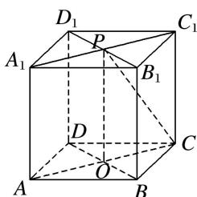

> [!faq]- 《专题07 立体几何中空间角的计算-立体几何（文理通用）》例题解析
>
> > [!success]- **【答案】** A
>
> > [!note]- **【解析】**
> > 答案 A 解析 易知 $AB = 2\sqrt{2}$ ，连接 $C_1P$ ，在 Rt△CC₁P 中，可计算 $C_1P = \sqrt{CP^2 - CC_1^2} = 2$ ，又 $A_1P = 2$ ， $A_1C_1 = 4$ ，所以 $P$ 是 $A_1C_1$ 的中点，连接 $AC$ 与 $BD$ 交于点 $O$ ，易证 $AC \perp$ 平面 BDD₁B₁，直线 CP 在平面 BDD₁B₁ 内的射影是 OP，所以 ∠CPO 就是直线 CP 与平面 BDD₁B₁ 所成的角，在 Rt△CPO 中，tan ∠CPO = $\frac{CO}{PO} = \frac{\sqrt{2}}{2}$ .
> >
> > 
