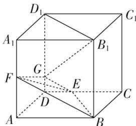

> [!faq]- 《专题07 立体几何中空间角的计算-立体几何（文理通用）》例题解析
>
> > [!success]- **【答案】** C
>
> > [!note]- **【解析】**
> > 答案 C 解析 因为平面 $ABCD \parallel$ 平面 $A_{1}B_{1}C_{1}D_{1}$ ，所以 $B_{1}G$ 与平面 $ABCD$ 所成角即为 $B_{1}G$ 与平面 $A_{1}B_{1}C_{1}D_{1}$ 所成角，易知 $B_{1}G$ 与平面 $A_{1}B_{1}C_{1}D_{1}$ 所成角为 $\angle D_{1}B_{1}G$ 。设 $AB = 6$ ，则 $AF = 3$ ， $DE = 2$ ，平面 $BEF \cap$ 平面 $CDD_{1}C_{1} = GE$ 且 $BF \parallel$ 平面 $CDD_{1}C_{1}$ ，可知 $BF \parallel GE$ ，易得 $\triangle FAB \sim \triangle GDE$ ，则 $\frac{AF}{AB} = \frac{DG}{DE}$ ，即 $\frac{3}{6} = \frac{DG}{2} \Rightarrow DG = 1$ ， $D_{1}G = 5$ ，在 Rt $\triangle B_{1}D_{1}G$ 中， $\tan \angle D_{1}B_{1}G = \frac{D_{1}G}{B_{1}D_{1}} = \frac{5}{6\sqrt{2}} = \frac{5\sqrt{2}}{12}$ ，故 $B_{1}G$ 与平面 $ABCD$ 所成角的正切值为 $\frac{5\sqrt{2}}{12}$ ，故选 C.
> >
> > 
