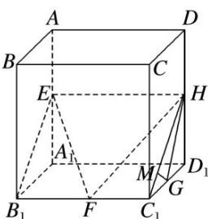

> [!faq]- 《专题07 立体几何中空间角的计算-立体几何（文理通用）》例题解析
>
> > [!success]- **【答案】** 详见解析
>
> > [!note]- **【解析】**
> > 答案 $\frac{3\sqrt{10}}{10}$ 解析 连接 $B_{1}E, HC_{1}$ , 平面 $EFH$ 即平面 $B_{1}C_{1}HE$ .
> >
> > 
> >
> > 在正方体 $AC_{1}$ 中， $B_{1}C_{1}\perp$ 平面 $CDD_{1}C_{1}$ ，故平面 $B_{1}C_{1}HE\perp$ 平面 $CDD_{1}C_{1}$ ，过点 G 作 $GM\perp C_{1}H$ 于 M，则 $GM\perp$ 平面 $B_{1}C_{1}HE$ ，则 $\angle C_{1}HG$ 即为 GH 与平面 EFH 所成的角，设正方体棱长为 2，则 $GH=\sqrt{2}$ ， $C_{1}G=1$ ， $C_{1}H=\sqrt{5}$ ， $\therefore\cos\angle C_{1}HG=\frac{C_{1}H^{2}+GH^{2}-C_{1}G^{2}}{2C_{1}H\cdot GH}=\frac{5+2-1}{2\times\sqrt{5}\times\sqrt{2}}=\frac{3\sqrt{10}}{10}$ .
