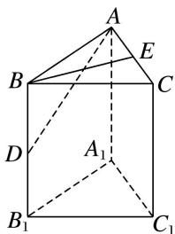

> [!faq]- 《专题07 立体几何中空间角的计算-立体几何（文理通用）》例题解析
>
> > [!success]- **【答案】** A
>
> > [!note]- **【解析】**
> > 答案 B 解析 如图，取 AC 的中点 E，连接 BE，可得 $\cdot=(+) \cdot =\cdot=4 \times 2\sqrt{3} \times \frac{\sqrt{3}}{2}=12=5 \times 2\sqrt{3} \times \cos \theta (\theta$ 为与的夹角)，所以 $\cos \theta = \frac{2\sqrt{3}}{5}, \sin \theta = \frac{\sqrt{13}}{5}$ ，又因为 $BE \perp$ 平面 $AA_{1}C_{1}C$ ，所以所求角即为 $\frac{\pi}{2}-\theta$ ，所以 $\tan\left(\frac{\pi}{2}-\theta\right)=\frac{\sin\left(\frac{\pi}{2}-\theta\right)}{\cos\left(\frac{\pi}{2}-\theta\right)}=\frac{\cos \theta}{\sin \theta}=\frac{2\sqrt{39}}{13}$ .
> >
> > 
