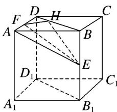

> [!faq]- 《专题07 立体几何中空间角的计算-立体几何（文理通用）》例题解析
>
> > [!success]- **【答案】** B
>
> > [!note]- **【解析】**
> > 答案 B 解析 连接 $AE, BD$ , 过点 $F$ 作 $FH \perp BD$ 交 $BD$ 于 $H$ , 连接 $EH$ , 则 $FH \perp$ 平面 $BDD_{1}B_{1}$ ,
> >
> > 
> >
> > ∴ $\angle FEH$ 是直线 EF 和平面 $BDD_{1}B_{1}$ 所成的角．设正方体 $ABCD-A_{1}B_{1}C_{1}D_{1}$ 的棱长为 2，∵ E，F 分别是棱 $BB_{1}$ ，AD 的中点，∴ 在 Rt△DFH 中， $DF=1,\quad\angle FDH=45^{\circ}$ ，可得 $FH=\frac{\sqrt{2}}{2}DF=\frac{\sqrt{2}}{2}$ ．在 Rt△AEF 中，AF=1， $AE=\sqrt{AB^{2}+BE^{2}}=\sqrt{5}$ ，可得 $EF=\sqrt{AF^{2}+AE^{2}}=\sqrt{6}$ ．在 Rt△EFH 中， $\sin\angle FEH=\frac{FH}{EF}=\frac{\sqrt{3}}{6}$ ，∴ 直线 EF 和平面 $BDD_{1}B_{1}$ 所成的角的正弦值是 $\frac{\sqrt{3}}{6}$ .
