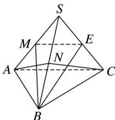

> [!faq]- 《专题07 立体几何中空间角的计算-立体几何（文理通用）》例题解析
>
> > [!success]- **【答案】** 详见解析
>
> > [!note]- **【分析】**
> > 本题未单列分析。
>
> > [!note]- **【解析】**
> > 答案 $\frac{1}{4} 60^{\circ}$ 解析 取 $SA$ 的中点 $M$ , 连接 $ME, BM$ , 则直线 $AC$ 与 $BE$ 所成的角等于直线 $ME$ 与 $BE$ 所成的角, 因为 $ME = \sqrt{3}$ , $BM = BE = 2\sqrt{3}$ , $\cos \angle MEB = \frac{3 + 12 - 12}{2 \times \sqrt{3} \times 2\sqrt{3}} = \frac{1}{4}$ , 所以直线 $AC$ 与 $BE$ 所成角的余弦值为 $\frac{1}{4}$ . 取 $SB$ 的中点 $N$ , 连接 $AN, CN$ , 则 $AN \perp SB$ , $CN \perp SB \Rightarrow SB \perp$ 平面 $ACN \Rightarrow$ 平面 $SAB \perp$ 平面 $ACN$ , 因此直线 $AC$ 与平面 $SAB$ 所成的角为 $\angle CAN$ , 因为 $AN = CN = AC = 2\sqrt{3}$ , 所以 $\angle CAN = 60^{\circ}$ , 因此直线 $AC$ 与平面 $SAB$ 所成的角为 $60^{\circ}$ .
> >
> > 
