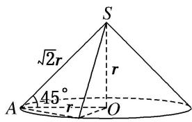

> [!faq]- 《专题07 立体几何中空间角的计算-立体几何（文理通用）》例题解析
>
> > [!success]- **【答案】** 详见解析
>
> > [!note]- **【分析】**
> > 本题未单列分析。
>
> > [!note]- **【解析】**
> > 解析：如图，∵SA与圆锥底面所成角为 $45^{\circ}$ ，∴△SAO为等腰直角三角形．设OA=r，则SO=r，SA=SB= $\sqrt{2}r$ 。在△SAB中， $\cos\angle ASB=\frac{7}{8}$ ，∴ $\sin\angle ASB=\frac{\sqrt{15}}{8}$ ，∴ $S_{\triangle SAB}=\frac{1}{2}SA\cdot SB\cdot\sin\angle ASB=\frac{1}{2}\times(\sqrt{2}r)^{2}\times\frac{\sqrt{15}}{8}=5\sqrt{15}$ ，解得 $r=2\sqrt{10}$ ，∴SA= $\sqrt{2}r=4\sqrt{5}$ ，即母线长 $l=4\sqrt{5}$ ，∴ $S_{圆锥侧}=\pi rl=\pi\times2\sqrt{10}\times4\sqrt{5}=40\sqrt{2}\pi$ 。
> > 答案： $40\sqrt{2}\pi$
> > 
> > B
