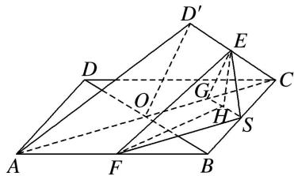

> [!faq]- 《专题07 立体几何中空间角的计算-立体几何（文理通用）》例题解析
>
> > [!success]- **【答案】** C
>
> > [!note]- **【分析】**
> > 本题未单列分析。
>
> > [!note]- **【解析】**
> > 答案 C 解析 分别连接 BD 交 AC 于点 O，连接 D'O。因为 $AD' = CD'$ ，所以 $D'O \perp AC$ ，又因为 $AC \perp BD$ ， $BD \cap D'O = O$ ，所以 $AC \perp$ 平面 $BDD'$ ，又 $BD' \subset$ 平面 $BDD'$ ，所以 $AC \perp BD'$ 。取 BC 的中点 S，连接 FS，ES，则 $FS \parallel AC$ ， $ES \parallel BD'$ ，所以 $FS \perp ES$ ，又因为 $\angle EFS$ 为异面直线 AC 与 EF 所成的角，所以 $\tan \beta = \frac{ES}{FS} = \frac{1}{2}$ ，设 ES = 1，则 FS = 2，AC = 4，取 CO 的中点 G，连接 EG，SG，则 EG = SG = 1，所以 $\triangle EGS$ 为等边三角形，过点 E 作 $EH \perp GS$ ，由上可知 $AC \perp EG$ ， $AC \perp SG$ 且 $EG \cap SG = G$ ，则 $AC \perp$ 平面 EGS. 又 $EH \subset$ 平面 EGS，所以 $EH \perp AC$ ，又 $GS \cap AC = G$ ，所以 $EH \perp$ 平面 ABCD，所以 $\angle EFH$ 为 EF 与平面 ABCD 所成的角，因为 $EH = \frac{\sqrt{3}}{2}$ ， $FH = \sqrt{4 + \frac{1}{4}} = \frac{\sqrt{17}}{2}$ ，所以 $\tan \angle EFH = \frac{EH}{FH} = \frac{\sqrt{51}}{17}$ ，故选 C.
> > 
