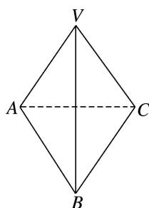

<!-- question-source:start -->
[例 3](1)如图，在三棱锥 V-ABC 中，VA=AB=VB=AC=BC=2， $VC=\sqrt{3}$ ，则二面角 V-AB-C 的大小为 \_\_\_\_.

<!-- question-source:end -->

![[高中/总复习/专题/立体几何/专题07 立体几何中空间角的计算-立体几何（文理通用）/考点03_二面角/例题/answers/Q00039629A1.md]]
