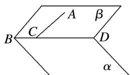

<!-- question-source:start -->
(4)如图, 平面 $\beta$ 内一条直线 $AC$ , $AC$ 与平面 $\alpha$ 所成的角为 $30^{\circ}$ , $AC$ 与棱 $BD$ 所成的角为 $45^{\circ}$ , 则平面 $\alpha$ 与平面 $\beta$ 所成的角的大小为 \_\_\_\_.

<!-- question-source:end -->

![[高中/总复习/专题/立体几何/专题07 立体几何中空间角的计算-立体几何（文理通用）/考点03_二面角/例题/answers/Q00043563A1.md]]
