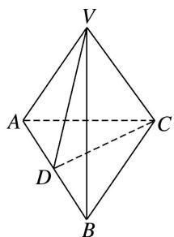

> [!faq]- 《专题07 立体几何中空间角的计算-立体几何（文理通用）》例题解析
>
> > [!success]- **【答案】** 详见解析
>
> > [!note]- **【分析】**
> > 本题未单列分析。
>
> > [!note]- **【解析】**
> > 答案 $60^{\circ}$ 解析 取 AB 的中点 D，连接 VD，CD，
> >
> > 
> >
> > $\because \triangle VAB$ 中， $VA=VB=AB=2,\therefore\triangle VAB$ 为等边三角形， $\therefore VD\perp AB$ 且 $VD=\sqrt{3}$ ，同理 $CD\perp AB,CD=\sqrt{3},\therefore\angle VDC$ 为二面角V-AB-C的平面角，
> >
> > 而 $\triangle VDC$ 是等边三角形， $\angle VDC=60^{\circ}$ ，∴二面角V-AB-C的大小为 $60^{\circ}$ .
