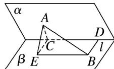

> [!faq]- 《专题07 立体几何中空间角的计算-立体几何（文理通用）》例题解析
>
> > [!success]- **【答案】** 详见解析
>
> > [!note]- **【解析】**
> > 答案 $\frac{\sqrt{3}}{5}$ 解析 如图，作 $AC \perp l, BD \perp l, C, D$ 为垂足，
> >
> > 
> >
> > 则 AC=2, BD=4, AB=10. 在 $\beta$ 内过 C 作 $CE \parallel DB$ ，且 CE=DB，连接 BE, AE,
> >
> > ∴四边形CEBD为平行四边形，∴BE//l，∴∠ABE为AB与棱l所成的角，
> >
> > ∵ BD // CE，∴ l⊥AC，l⊥CE，∴ ∠ACE 为 α-l-β 的平面角，
> >
> > $\therefore \angle ACE = 60^{\circ}, AC = 2, BD = 4, \therefore AE = \sqrt{2^{2} + 4^{2} - 2 \times 2 \times 4 \times \frac{1}{2}} = 2\sqrt{3}.$
> >
> > 又 $BE \parallel l, l \perp$ 平面 $ACE, \therefore BE \perp AE, \therefore \sin \angle ABE = \frac{AE}{AB} = \frac{2\sqrt{3}}{10} = \frac{\sqrt{3}}{5}$ .
