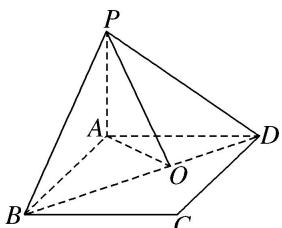

> [!faq]- 《专题07 立体几何中空间角的计算-立体几何（文理通用）》例题解析
>
> > [!success]- **【答案】** A
>
> > [!note]- **【分析】**
> > 本题未单列分析。
>
> > [!note]- **【解析】**
> > 答案 A 解析 作 $AO \perp BD$ 交 $BD$ 于点 $O$ , $\because PA \perp$ 平面 $ABCD$ , $\therefore PA \perp BD$ . $\because PA \cap AO = A$ , $\therefore BD \perp$ 平面 $PAO$ , $\therefore PO \perp BD$ , $\therefore \angle AOP$ 即为所求二面角 $A - BD - P$ 的大小. $\because AO = \frac{AB \cdot AD}{BD} = \frac{12}{5}$ , $\therefore \tan \angle AOP = \frac{AP}{AO} = \frac{\sqrt{3}}{3}$ , 故二面角 $A - BD - P$ 的大小为 $30^\circ$ .
> >
> > 
