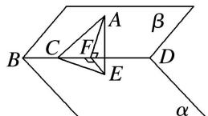

> [!faq]- 《专题07 立体几何中空间角的计算-立体几何（文理通用）》例题解析
>
> > [!success]- **【答案】** 详见解析
>
> > [!note]- **【分析】**
> > 本题未单列分析。
>
> > [!note]- **【解析】**
> > 答案 $45^{\circ}$ 解析 如图，过 A 作 $AF \perp BD$ ，F 为垂足，作 $AE \perp$ 平面 $\alpha$ ，E 为垂足，连接 EF，CE，
> >
> > 
> >
> > ∴由三垂线定理知 $BD \perp EF$ ，∴ $\angle AFE$ 为平面 $\alpha$ 与平面 $\beta$ 所成的角．依题意 $\angle ACF = 45^{\circ}$ ， $\angle ACE = 30^{\circ}$ ，设 AC=2，∴ $AF=CF=\sqrt{2}$ ，AE=1，∴ $\sin\angle AFE=\frac{AE}{AF}=\frac{1}{\sqrt{2}}=\frac{\sqrt{2}}{2}$ ，∴ $AFE=45^{\circ}$ 。∴ 平面 $\alpha$ 与平面 $\beta$ 所成的角为 $45^{\circ}$ 。
