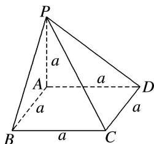

> [!faq]- 《专题07 立体几何中空间角的计算-立体几何（文理通用）》例题解析
>
> > [!success]- **【答案】** 详见解析
>
> > [!note]- **【分析】**
> > 本题未单列分析。
>
> > [!note]- **【解析】**
> > 解析 如图，∵PA⊥平面ABCD，AD⊂平面ABCD，∴PA⊥AD，又AD⊥AB，且PA∩AB=A，
> >
> > 
> >
> > $PA, AB \subset$ 平面 $PAB$ , $\therefore AD \perp$ 平面 $PAB$ , 同理 $BC \perp$ 平面 $PAB$ . $\therefore \triangle PCD$ 在平面 $PBA$ 上的射影为 $\triangle PAB$ , 设平面 $PBA$ 与平面 $PCD$ 所成二面角为 $\theta$ , $\therefore \cos \theta = \frac{S_{\triangle PAB}}{S_{\triangle PCD}} = \frac{\frac{1}{2} a^2}{\frac{1}{2} \times a \times \sqrt{2} a} = \frac{\sqrt{2}}{2}$ , $\therefore \theta = 45^\circ$ . 故平面 $PBA$ 与平面 $PCD$ 所成二面角的大小为 $45^\circ$ .
> >
> > ## 【对点训练】
