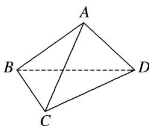

<!-- question-source:start -->
2. 如图所示, 已知三棱锥 $A - BCD$ 的各棱长均为 2 , 则二面角 $A - CD - B$ 的平面角的余弦值为

<!-- question-source:end -->

![[高中/总复习/专题/立体几何/专题07 立体几何中空间角的计算-立体几何（文理通用）/考点03_二面角/对点训练/answers/Q00039631A1.md]]
