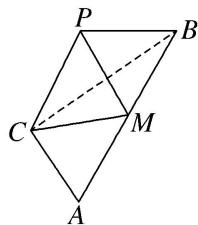

<!-- question-source:start -->
6. 已知 $\triangle ABC$ 中, $\angle C = 90^{\circ}$ , $\tan A = \sqrt{2}$ , $M$ 为 $AB$ 的中点, 现将 $\triangle ACM$ 沿 $CM$ 折起, 得到三棱锥 $P - CBM$ , 如图所示. 则当二面角 $P - CM - B$ 的大小为 $60^{\circ}$ 时, $\frac{AB}{PB} =$ \_\_\_\_.

<!-- question-source:end -->

![[高中/总复习/专题/立体几何/专题07 立体几何中空间角的计算-立体几何（文理通用）/考点03_二面角/对点训练/answers/Q00039635A1.md]]
