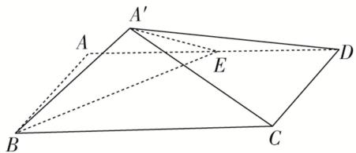

<!-- question-source:start -->
8. 如图, 矩形 $ABCD$ 中, $AB = 1$ , $BC = 2$ , 点 $E$ 为 $AD$ 的中点, 将 $\triangle ABE$ 沿 $BE$ 折起, 在翻折过程中, 记

点 A 对应的点为 $A'$ ，二面角 $A' - DC - B$ 的平面角的大小为 $\alpha$ ，则当 $\alpha$ 最大时， $\tan\alpha = (\quad)$

A. $\frac{\sqrt{2}}{2}$ B. $\frac{\sqrt{2}}{3}$ C. $\frac{1}{3}$ D. $\frac{1}{2}$
<!-- question-source:end -->

![[高中/总复习/专题/立体几何/专题07 立体几何中空间角的计算-立体几何（文理通用）/考点03_二面角/对点训练/answers/Q00039636A1.md]]
