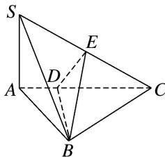

<!-- question-source:start -->
10. 如图，在三棱锥 $S - ABC$ 中， $SA \perp$ 底面 $ABC$ ， $AB \perp BC$ ， $DE$ 垂直平分 $SC$ 且分别交 $AC$ ， $SC$ 于点 $D$ ， $E$ ，又 $SA = AB$ ， $SB = BC$ ，则二面角 $E - BD - C$ 的大小为 \_\_\_\_.

<!-- question-source:end -->

![[高中/总复习/专题/立体几何/专题07 立体几何中空间角的计算-立体几何（文理通用）/考点03_二面角/对点训练/answers/Q00039638A1.md]]
