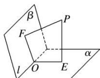
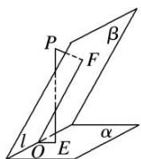

> [!faq]- 《专题07 立体几何中空间角的计算-立体几何（文理通用）》例题解析
>
> > [!success]- **【答案】** C
>
> > [!note]- **【分析】**
> > 本题未单列分析。
>
> > [!note]- **【解析】**
> > 答案 C 解析 如图所示，过 PE, PF 作一个平面 $\gamma$ 与二面角 $\alpha - l - \beta$ 的棱交于点 O，连接 OE, OF.
> >
> > 
> >
> > 
> >
> > 因为 $PE \perp \alpha$ ， $PF \perp \beta$ ，所以 $PE \perp l$ ， $PF \perp l$ ，所以 $l \perp$ 平面 $\gamma$ ，所以 $l \perp OE$ ， $l \perp OF$ ，则 $\angle EOF$ 为 $\alpha - l - \beta$ 的平面角，且它与 $\angle EPF$ 相等或互补，故二面角 $\alpha - l - \beta$ 的平面角的大小为 $60^{\circ}$ 或 $120^{\circ}$ ，
> >
> > 故选 **C**.
