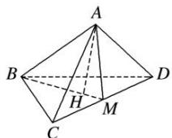

> [!faq]- 《专题07 立体几何中空间角的计算-立体几何（文理通用）》例题解析
>
> > [!success]- **【答案】** 详见解析
>
> > [!note]- **【解析】**
> > 答案 $\frac{1}{3}$ 解析 如图，取 $CD$ 的中点 $M$ ，连接 $AM$ ， $BM$ 则 $AM \perp CD$ ， $BM \perp CD$ 。由二面角的定义可知 $\angle AMB$ 为二面角 $A - CD - B$ 的平面角。设点 $H$ 是 $\triangle BCD$ 的中心，连接 $AH$ ，则 $AH \perp$ 平面 $BCD$ ，且点 $H$ 在线段 $BM$ 上。在 Rt $\triangle AMH$ 中， $AM = \frac{\sqrt{3}}{2} \times 2 = \sqrt{3}$ ， $HM = \frac{\sqrt{3}}{2} \times 2 \times \frac{1}{3} = \frac{\sqrt{3}}{3}$ ，则 $\cos \angle AMB = \frac{\sqrt{3}}{\sqrt{3}} = \frac{1}{3}$ ，即所求二面角的平面角的余弦值为 $\frac{1}{3}$ 。
> >
> > 
