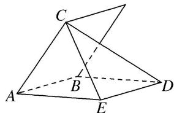

> [!faq]- 《专题07 立体几何中空间角的计算-立体几何（文理通用）》例题解析
>
> > [!success]- **【答案】** D
>
> > [!note]- **【分析】**
> > 本题未单列分析。
>
> > [!note]- **【解析】**
> > 答案 D 解析 如图， $AC \perp AB$ ， $BD \perp AB$ ，过 A 在平面 ABD 内作 $AE \parallel BD$ ，过 D 作 $DE \parallel AB$ ，连接 CE，所以 DE = AB 且 $DE \perp$ 平面 AEC， $\angle CAE$ 即二面角的平面角。在 Rt△DEC 中， $CD = 2\sqrt{17}$ ，DE = 4，则 $CE = 2\sqrt{13}$ ，在 △ACE 中，由余弦定理可得 $\cos \angle CAE = \frac{CA^{2} + AE^{2} - CE^{2}}{2CA \times AE} = \frac{1}{2}$ ，所以 $\angle CAE = 60^{\circ}$ ，即所求二面角的大小为 $60^{\circ}$ 。
> > 
