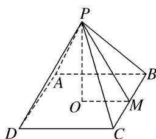

> [!faq]- 《专题07 立体几何中空间角的计算-立体几何（文理通用）》例题解析
>
> > [!success]- **【答案】** C
>
> > [!note]- **【解析】**
> > 答案 C 解析 如图，O 为正方形 ABCD 的中心，M 为 BC 的中点，连接 PO, PM, OM, $\angle PMO$ 即为侧面与底面所成二面角的平面角．设底面边长为 a，则 $2a^{2}=(2\sqrt{6})^{2}$ ， $\therefore a=2\sqrt{3}$ ， $\therefore OM=\sqrt{3}$ ．又四棱锥的体积 $V=\frac{1}{3}\times(2\sqrt{3})^{2}\times PO=12$ ， $\therefore PO=3$ ， $\therefore \tan\angle PMO=\frac{3}{\sqrt{3}}=\sqrt{3}$ ， $\therefore \angle PMO=60^{\circ}$ ．故所求二面角为 $60^{\circ}$ .
> >
> > 
