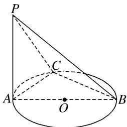

> [!faq]- 《专题07 立体几何中空间角的计算-立体几何（文理通用）》例题解析
>
> > [!success]- **【答案】** 详见解析
>
> > [!note]- **【分析】**
> > 本题未单列分析。
>
> > [!note]- **【解析】**
> > 答案 $60^{\circ}$ 解析 因为 $AB$ 为 $\odot O$ 的直径, 所以 $AC \perp BC$ , 又因为 $PA \perp$ 平面 $ABC$ , 所以 $PA \perp BC$ , 因为 $AC \cap PA = A$ , 所以 $BC \perp$ 平面 $PAC$ , 所以 $BC \perp PC$ , 所以 $\angle PCA$ 为二面角 $ABCP$ 的平面角. 因为 $\angle ACB = 90^{\circ}$ , $AB = 2$ , $PA = BC = \sqrt{3}$ , 所以 $AC = 1$ , 所以在 Rt $\triangle PAC$ 中, $\tan \angle PCA = \frac{PA}{AC} = \sqrt{3}$ . 所以 $\angle PCA = 60^{\circ}$ . 即所求二面角的大小为 $60^{\circ}$ .
> >
> > 
