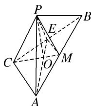
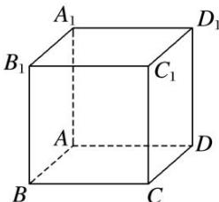

> [!faq]- 《专题07 立体几何中空间角的计算-立体几何（文理通用）》例题解析
>
> > [!success]- **【答案】** A
>
> > [!note]- **【分析】**
> > 本题未单列分析。
>
> > [!note]- **【解析】**
> > 答案 C 解析 如图，取 BC 的中点 E，连接 AE, EM, PE，设 $AE \cap CM = O$ ，连接 PO，再设 AC = 2，由 $\angle C = 90^{\circ}$ ， $\tan A = \sqrt{2}$ ，可得 $BC = 2\sqrt{2}$ 。在 Rt△MEC 中，可得 $\tan \angle CME = \sqrt{2}$ ，在 Rt△ECA 中，可得 $\tan \angle AEC = \sqrt{2}$ ，∴ $\angle CME + \angle AEM = 90^{\circ}$ ，∴ $AE \perp CM$ ，∴ $PO \perp CM$ ， $EO \perp CM$ ，∠POE 即为二面角 P - CM - B 的平面角，∴ $\angle POE = 60^{\circ}$ 。∵ $AE = \sqrt{2^{2} + (\sqrt{2})^{2}} = \sqrt{6}$ ， $OE = 1 \times \sin \angle CME = \frac{\sqrt{6}}{3}$ ，∴ PO = AO = $\frac{2\sqrt{6}}{3}$ 。在 △POE 中，由余弦定理可得， $PE = \sqrt{\left(\frac{2\sqrt{6}}{3}\right)^{2} + \left(\frac{\sqrt{6}}{3}\right)^{2} - 2 \times \frac{2\sqrt{6}}{3} \times \frac{\sqrt{6}}{3} \times \frac{1}{2}} = \sqrt{2}$ ，∴ $PE^{2} + CE^{2} = PC^{2}$ ，即 $PE \perp BC$ 。又∵ E 为 BC 的中点，∴ PB = PC = 2。在 Rt△ACB 中，易得 $AB = 2\sqrt{3}$ ，∴ $\frac{AB}{PB} = \sqrt{3}$ 。
> >
> > 
> >
> > 7. (多选)在正方体 $ABCD-A_{1}B_{1}C_{1}D_{1}$ 中，下列说法正确的是()
> >
> > 
> >
> > A. $A_{1}C_{1}\bot BD$ B. $B_{1}C$ 与 $BD$ 所成的角为 $60^{\circ}$ C.二面角 $A_{1} - BC - D$ 的平面角为 $45^{\circ}$ D. $AC_{1}$ 与平面ABCD所成的角为 $45^{\circ}$
> >
> > 7. 答案 ABC 解析 $A_{1}C_{1} \perp B_{1}D_{1}$ 且 $B_{1}D_{1} // BD$ , $\therefore A_{1}C_{1} \perp BD$ , $\therefore A$ 正确; $B_{1}C // A_{1}D$ , $B_{1}C$ 与 $BD$ 所成的角即为 $\angle A_{1}DB = 60^{\circ}$ , $\therefore B$ 正确; $\angle A_{1}BA$ 即为二面角 $A_{1} - BC - D$ 的平面角, $\angle A_{1}BA = 45^{\circ}$ , $\therefore C$ 正确; $CC_{1} \perp$ 平面 $ABCD$ , $\therefore \angle C_{1}AC$ 为 $AC_{1}$ 与平面 $ABCD$ 所成的角, $\because CC_{1} \neq AC$ , $\therefore \angle C_{1}AC \neq 45^{\circ}$ , $\therefore D$ 错误.
