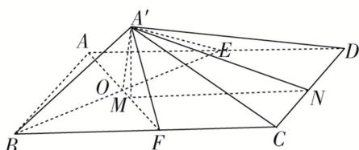

> [!faq]- 《专题07 立体几何中空间角的计算-立体几何（文理通用）》例题解析
>
> > [!success]- **【答案】** D
>
> > [!note]- **【分析】**
> > 本题未单列分析。
>
> > [!note]- **【解析】**
> > 答案 D 解析 如图，取 BC 的中点 F，连接 AF，交 BE 于点 O，则 $AF \perp BE$ ，连接 $OA'$ ， $A'F$ ，则 $OA' = OA = \frac{\sqrt{2}}{2}$ ， $OA' \perp BE$ ， $OF \perp BE$ ，又 $OA' \cap OF = O$ ，所以 $BE \perp$ 平面 $OA'F$ ，又 $BE \subset$ 平面 ABCD，所以平面 $OA'F \perp$ 平面 ABCD。设 $A'$ 在 AF 上的投影为 M，连接 $A'M$ ，设 $\angle A'OM = \beta$ ，则 $A'M = \frac{\sqrt{2}}{2}\sin\beta$ ， $OM = \frac{\sqrt{2}}{2}\cos\beta$ ，过点 M 作 $MN \perp CD$ 交 CD 于点 N，连接 $A'N$ ，则 $\angle A'NM = \alpha$ 。易得 $\alpha \in \begin{pmatrix} 0, & \frac{\pi}{2} \\ -\frac{1}{2} - \frac{1}{2}\cos\beta \end{pmatrix}$ ， $MN = \frac{3}{2} - \frac{1}{2}\cos\beta$ ，所以当 $\alpha$ 最大时， $\tan\alpha$ 最大， $\tan\alpha = \frac{\frac{\sqrt{2}}{2}\sin\beta}{\frac{3}{2} - \frac{1}{2}\cos\beta} = \frac{\sqrt{2}\sin\beta}{3 - \cos\beta}$ ，令 $\frac{\sqrt{2}\sin\beta}{3 - \cos\beta} = t$ ，所以 $\sqrt{2}\sin\beta = 3t - t\cos\beta$ ，所以 $3t = \sqrt{2}\sin\beta + t\cos\beta = \sqrt{2 + t^2}\sin(\beta + \theta)\left[\text{其中 }\tan\theta = \frac{t}{\sqrt{2}}\right]$ ，所以 $3t \leq \sqrt{2 + t^2}$ ，所以 $t \leq \frac{1}{2}$ ，即 $\tan\alpha \leq \frac{1}{2}$ ，故选 D。
> >
> > 
