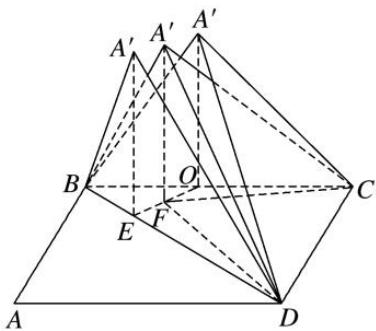

> [!faq]- 《专题07 立体几何中空间角的计算-立体几何（文理通用）》例题解析
>
> > [!success]- **【答案】** D
>
> > [!note]- **【分析】**
> > 本题未单列分析。
>
> > [!note]- **【解析】**
> > 答案 D 解析 如图，∵四边形 ABCD 为矩形，∴ $BA'\perp A'D$ ，当 $A'$ 点在底面上的射影 $O$ 落在 $BC$ 上时，有平面 $A'BC \perp$ 底面 $BCD$ ，又 $DC \perp BC$ ，平面 $A'BC \cap$ 平面 $BCD = BC$ ， $DC \subset$ 平面 $BCD$ ，可得 $DC \perp$ 平面 $A'BC$ ，则 $DC \perp BA'$ ， $\therefore BA' \perp$ 平面 $A'DC$ ，在 Rt $\triangle BA'C$ 中，设 $BA' = 1$ ，则 $BC = \sqrt{2}$ ， $\therefore A'C = 1$ ，说明 $O$ 为 $BC$ 的中点；当 $A'$ 点在底面上的射影 $E$ 落在 $BD$ 上时，可知 $A'E \perp BD$ ，设 $BA' = 1$ ，则 $A'D = \sqrt{2}$ ， $\therefore A'E = \frac{\sqrt{6}}{3}$ ， $BE = \frac{\sqrt{3}}{3}$ 。要使点 $A'$ 在平面 $BCD$ 上的射影 $F$ 在 $\triangle BCD$ 内(不含边界)，则点 $A'$ 的射影 $F$ 落在线段 $OE$ 上(不含端点)。可知 $\angle A'EF$ 为二面角 $A' - BD - C$ 的平面角 $\theta$ ，直线 $A'D$ 与平面 $BCD$ 所成的角为 $\angle A'DF = \alpha$ ，直线 $A'C$ 与平面 $BCD$ 所成的角为 $\angle A'CF = \beta$ ，可求得 $DF > CF$ ， $\therefore A'C < A'D$ ，且 $A'E = \frac{\sqrt{6}}{3} < 1$ ，而 $A'C$ 的最小值为 1， $\therefore \sin \angle A'DF < \sin \angle A'CF < \sin \angle A'EO$ ，则 $\alpha < \beta < \theta$ 。
> >
> > 
