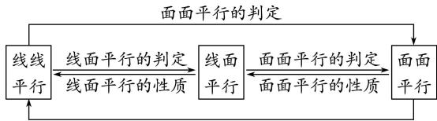
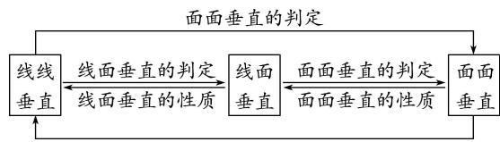

<!-- source-part:1 pages:1-21 -->

# 专题08 立体几何中平行与垂直的证明问题

## 1. 直线、平面平行的判定及其性质

(1)线面平行的判定定理： $a \notin \alpha,\quad b \subset \alpha,\quad a \parallel b \Rightarrow a \parallel \alpha.$

(2)线面平行的性质定理： $a \parallel \alpha, \quad a \subset \beta, \quad \alpha \cap \beta = b \Rightarrow a \parallel b.$

(3)面面平行的判定定理： $a \subset \beta$ ， $b \subset \beta$ ， $a \cap b = P$ ， $a \parallel \alpha$ ， $b \parallel \alpha \Rightarrow \alpha \parallel \beta$ .

(4)面面平行的性质定理： $\alpha//\beta,\quad\alpha\cap\gamma=a,\quad\beta\cap\gamma=b\Rightarrow a//b.$

平行问题的转化

  
面面平行的性质

利用线线平行、线面平行、面面平行的相互转化解决平行关系的判定问题时，一般遵循从“低维”到“高维”的转化，即从“线线平行”到“线面平行”，再到“面面平行”；而应用性质定理时，其顺序正好相反。在实际的解题过程中，判定定理和性质定理一般要相互结合，灵活运用。

平行关系的基础是线线平行，证明线线平行常用的方法：一是利用平行公理，即证两直线同时和第三条直线平行；二是利用平行四边形进行平行转换：三是利用三角形的中位线定理证线线平行；四是利用线段的比例关系证明线线平行；五是利用线面平行、面面平行的性质定理进行平行转换。

## 2. 直线、平面垂直的判定及其性质

(1)线面垂直的判定定理： $m \subset \alpha$ ， $n \subset \alpha$ ， $m \cap n = P$ ， $l \perp m$ ， $l \perp n \Rightarrow l \perp \alpha$ .

(2)线面垂直的性质定理： $a \perp \alpha$ ， $b \perp \alpha \Rightarrow a // b$ .

(3)面面垂直的判定定理： $a \subset \beta$ ， $a \perp \alpha \Rightarrow \alpha \perp \beta$ .

(4)面面垂直的性质定理： $\alpha\perp\beta,\quad\alpha\cap\beta=l,\quad a\subset\alpha,\quad a\perp l\Rightarrow a\perp\beta.$

垂直问题的转化

  
面面垂直的性质

在空间垂直关系中，线面垂直是核心，已知线面垂直，既可为证明线线垂直提供依据，又可为利用判定定理证明面面垂直作好铺垫。应用面面垂直的性质定理时，一般需作辅助线，基本作法是过其中一个平面内一点作交线的垂线，从而把面面垂直问题转化为线面垂直问题，进而可转化为线线垂直问题。

垂直关系的基础是线线垂直，证明线线垂直常用的方法：一是利用等腰三角形底边中线即高线的性质；二是利用勾股定理；三是利用线面垂直的性质：即要证两线垂直，只需证明一线垂直于另一线所在的平面即可， $l \perp \alpha$ ， $a \subset \alpha \Rightarrow l \perp a$ .

![[高中/总复习/专题/立体几何/专题08 立体几何中平行与垂直的证明问题-立体几何（文科）/考点01_线线垂直_线面平行问题/考点01_线线垂直_线面平行问题.md]]
![[高中/总复习/专题/立体几何/专题08 立体几何中平行与垂直的证明问题-立体几何（文科）/考点02_线线_线面__面面_平行_线面垂直问题/考点02_线线_线面__面面_平行_线面垂直问题.md]]
![[高中/总复习/专题/立体几何/专题08 立体几何中平行与垂直的证明问题-立体几何（文科）/考点03_线面平行_面面垂直问题/考点03_线面平行_面面垂直问题.md]]
