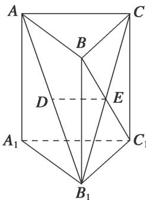

<!-- question-source:start -->
[例 2](2015·江苏)如图，在直三棱柱 $ABC-A_{1}B_{1}C_{1}$ 中，已知 $AC \perp BC, BC = CC_{1}$ 。设 $AB_{1}$ 的中点为 D， $B_{1}C \cap BC_{1} = E$ 。

求证：(1) $DE \parallel$ 平面 $AA_{1}C_{1}C$ ; (2) $BC_{1} \perp AB_{1}$ .

<!-- question-source:end -->

![[高中/总复习/专题/立体几何/专题08 立体几何中平行与垂直的证明问题-立体几何（文科）/考点01_线线垂直_线面平行问题/例题/answers/Q00039640A1.md]]
