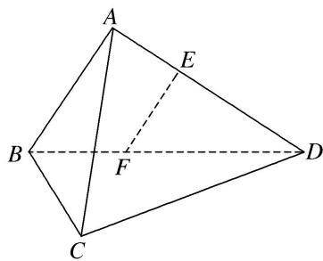

<!-- question-source:start -->
[例 1](2017·江苏)如图，在三棱锥 A—BCD 中， $AB \perp AD$ ， $BC \perp BD$ ，平面 $ABD \perp$ 平面 BCD，点 E， $F(E$

与 A, D 不重合)分别在棱 AD, BD 上, 且 $EF \perp AD$ .

求证：
(1)EF//平面ABC；
(2)AD⊥AC.

<!-- question-source:end -->

![[高中/总复习/专题/立体几何/专题08 立体几何中平行与垂直的证明问题-立体几何（文科）/考点01_线线垂直_线面平行问题/例题/answers/Q00043565A1.md]]
