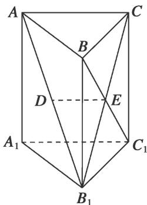
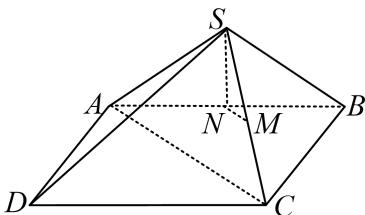
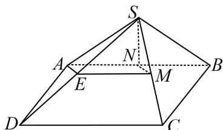
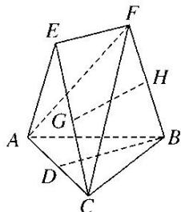
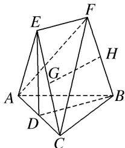
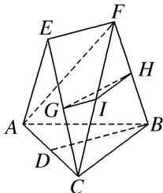

> [!faq]- 《专题08 立体几何中平行与垂直的证明问题-立体几何（文科）》例题解析
>
> > [!success]- **【答案】** 详见解析
>
> > [!note]- **【分析】**
> > 本题未单列分析。
>
> > [!note]- **【解析】**
> > 解析 (1)由题意知， $E$ 为 $B_{1}C$ 的中点，又 $D$ 为 $AB_{1}$ 的中点，因此 $DE \parallel AC$ .
> > 又因为 $DE \not\subset$ 平面 $AA_{1}C_{1}C$ ， $AC \subset$ 平面 $AA_{1}C_{1}C$ ，所以 $DE \parallel$ 平面 $AA_{1}C_{1}C$ .
> > 
> > (2)因为棱柱 $ABCA_{1}B_{1}C_{1}$ 是直三棱柱，所以 $CC_{1} \perp$ 平面 ABC.
> > 因为 $AC \subset$ 平面 ABC，所以 $AC \perp CC_{1}$ .
> > 又因为 $AC \perp BC$ ， $CC_{1} \subset$ 平面 $BCC_{1}B_{1}$ ， $BC \subset$ 平面 $BCC_{1}B_{1}$ ， $BC \cap CC_{1} = C$ ，所以 $AC \perp$ 平面 $BCC_{1}B_{1}$ .
> > 又因为 $BC_{1} \subset$ 平面 $BCC_{1}B_{1}$ , 所以 $BC_{1} \perp AC$ . 因为 $BC = CC_{1}$ , 所以矩形 $BCC_{1}B_{1}$ 是正方形, 因此 $BC_{1} \perp B_{1}C$ . 因为 $AC, B_{1}C \subset$ 平面 $B_{1}AC, AC \cap B_{1}C = C$ , 所以 $BC_{1} \perp$ 平面 $B_{1}AC$ . 又因为 $AB_{1} \subset$ 平面 $B_{1}AC$ , 所以 $BC_{1} \perp AB_{1}$ . [例3]如图, 在四棱锥 $S - ABCD$ 中, 已知 $SA = SB$ , 四边形 $ABCD$ 是平行四边形, 且平面 $SAB \perp$ 平面 $ABCD$ , 点 $M, N$ 分别是 $SC, AB$ 的中点.
> > 求证：(1)MN//平面 SAD；(2)SN⊥AC.
> > 
> > 解析 (1)取 SD 的中点 E，连接 EM，EA.
> > 
> > ∵M是SC的中点，∴EM//CD，且 $EM=\frac{1}{2}CD$ ．∵底面ABCD是平行四边形，N为AB的中点，
> > ∴AN//CD，且 $AN=\frac{1}{2}CD$ ，∴EM//AN，EM=AN，∴四边形EMNA是平行四边形，∴MN//AE.
> > ∵MN∉平面SAD，AE⊂平面SAD，∴MN//平面SAD.
> > (2) $\because SA=SB,\ N$ 是 AB 的中点， $\therefore SN\perp AB,\ \because$ 平面 $SAB\perp$ 平面 ABCD,
> > $$
> > A B C D = A B
> > $$
> > $$
> > A B C D, \therefore S N \perp A C
> > $$
> > $$
> > E F \mathbin {/ /} D B
> > $$
> > (1)已知 $AB = BC$ ， $AE = EC$ ，求证： $AC\bot FB$
> > (2)已知 G，H 分别是 EC 和 FB 的中点，求证：GH// 平面 ABC.
> > 
> > 解析 (1)因为 $EF \parallel DB$ ，所以 $EF$ 与 $DB$ 确定平面 $BDEF$ 。如图①，连接 $DE$ 。
> > 
> > 图①
> > 因为 $AE = EC$ ， $D$ 为 $AC$ 的中点，所以 $DE \perp AC$ 。同理可得 $BD \perp AC$ 。
> > 又 $BD \cap DE = D$ ，所以 $AC \perp$ 平面 BDEF。因为 $FB \subset$ 平面 BDEF，所以 $AC \perp FB$ 。
> > (2)如图②，设 FC 的中点为 I，连接 GI，HI.
> > 
> > 图②
> > 在 $\triangle CEF$ 中，因为 $G$ 是 $CE$ 的中点，所以 $GI//EF$ ．又 $EF//DB$ ，所以 $GI//DB$ ．
> > 在 $\triangle CFB$ 中，因为 $H$ 是 $FB$ 的中点，所以 $HI//BC$ ．又 $HI\cap GI=I$ ，所以平面 $GHI//$ 平面 $ABC$ ．
> > 因为 $GH \subset$ 平面 GHI，所以 $GH \parallel$ 平面 ABC.
> > ## 【对点训练】
