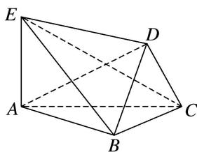

<!-- question-source:start -->
1. 如图，在六面体 $ABCDE$ 中，平面 $DBC \perp$ 平面 $ABC$ ， $AE \perp$ 平面 $ABC$ .

(1)求证： $AE \parallel$ 平面 DBC;

(2)若 $AB \perp BC$ ， $BD \perp CD$ ，求证： $AD \perp DC$ .

<!-- question-source:end -->

![[高中/总复习/专题/立体几何/专题08 立体几何中平行与垂直的证明问题-立体几何（文科）/考点01_线线垂直_线面平行问题/对点训练/answers/Q00043569A1.md]]
