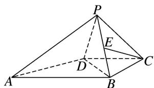

<!-- question-source:start -->
3. 如图，在四棱锥 $P - ABCD$ 中， $\angle ADB = 90^{\circ}$ ， $CB = CD$ ，点 $E$ 为棱 $PB$ 的中点.

(1)若 $PB = PD$ ，求证： $PC\bot BD$ ；
(2)求证： $CE / /$ 平面PAD.

<!-- question-source:end -->

![[高中/总复习/专题/立体几何/专题08 立体几何中平行与垂直的证明问题-立体几何（文科）/考点01_线线垂直_线面平行问题/对点训练/answers/Q00043571A1.md]]
