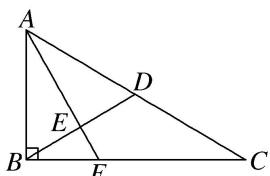
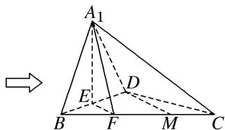

> [!faq]- 《专题08 立体几何中平行与垂直的证明问题-立体几何（文科）》例题解析
>
> > [!success]- **【答案】** 详见解析
>
> > [!note]- **【分析】**
> > 本题未单列分析。
>
> > [!note]- **【解析】**
> > (1)若 M 是 FC 的中点，求证：直线 DM// 平面 $A_{1}EF$ .
> > (2)求证： $BD \perp A_{1}F.$
> > (3)若平面 $A_{1}BD \perp$ 平面 $BCD$ ，试判断直线 $A_{1}B$ 与直线 $CD$ 能否垂直？请说明理由.
> > 
> > 图 1
> > 
> > 图2
> > 5. 解析 (1)证明：∵D，M分别为AC，FC的中点，∴DM//EF，
> > 又∵EF⊂平面 $A_{1}EF$ ，DM∉平面 $A_{1}EF$ ，∴DM//平面 $A_{1}EF$ .
> > (2)证明：∵ $EF\perp BD$ ， $A_{1}E\perp BD$ ， $A_{1}E\cap EF=E$ ，
> > $A_{1}E \subset$ 平面 $A_{1}EF$ , $EF \subset$ 平面 $A_{1}EF$ , $\therefore BD \perp$ 平面 $A_{1}EF$ , 又 $A_{1}F \subset$ 平面 $A_{1}EF$ , $\therefore BD \perp A_{1}F$ .
> > (3)直线 $A_{1}B$ 与直线 $CD$ 不能垂直．理由如下：
> > ∵平面 BCD⊥平面 $A_{1}BD$ ，平面 BCD∩平面 $A_{1}BD=BD$ ，EF⊥BD，EF⊂平面 BCD，∴EF⊥平面 $A_{1}BD$ ，又∵ $A_{1}B⊂$ 平面 $A_{1}BD$ ，∴ $A_{1}B\perp EF$ ，又∵DM//EF，∴ $A_{1}B\perp DM$ .
> > 假设 $A_{1}B \perp CD$ ， $\because DM \cap CD = D$ ， $\therefore A_{1}B \perp$ 平面 $BCD$ ， $\therefore A_{1}B \perp BD$ ，与 $\angle A_{1}BD$ 为锐角矛盾， $\therefore$ 直线 $A_{1}B$ 与直线 $CD$ 不能垂直.
