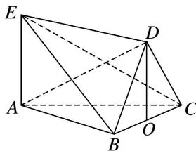

> [!faq]- 《专题08 立体几何中平行与垂直的证明问题-立体几何（文科）》例题解析
>
> > [!success]- **【答案】** 详见解析
>
> > [!note]- **【分析】**
> > 本题未单列分析。
>
> > [!note]- **【解析】**
> > (1)求证： $AE \parallel$ 平面 DBC;
> >
> > (2)若 $AB \perp BC$ ， $BD \perp CD$ ，求证： $AD \perp DC$ .
> >
> > 
> >
> > 1. 解析
> > (1) 过点 D 作 $DO \perp BC$ ，O 为垂足.
> >
> > 又∵平面 $DBC \perp$ 平面 ABC，平面 $DBC \cap$ 平面 ABC = BC，DO ⊂ 平面 DBC，
> >
> > ∴DO⊥平面ABC．又AE⊥平面ABC，∴AE//DO.
> >
> > 又 $AE \not\subset$ 平面 DBC, $DO \subset$ 平面 DBC, 故 $AE \parallel$ 平面 DBC.
> >
> > 
> >
> > (2)由
> > (1)知， $DO \perp$ 平面 ABC， $AB \subset$ 平面 ABC， $\therefore DO \perp AB$ .
> >
> > 又 $AB \perp BC$ ，且 $DO \cap BC = O$ ，DO， $BC \subset$ 平面 DBC，∴ $AB \perp$ 平面 DBC.
> >
> > ∵DC⊂平面DBC，∴AB⊥DC．又BD⊥CD，AB∩DB=B，AB，DB⊂平面ABD，
> >
> > ∴DC⊥平面ABD. 又AD⊂平面ABD, ∴AD⊥DC.
